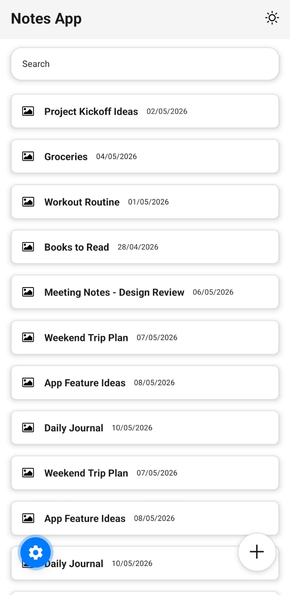
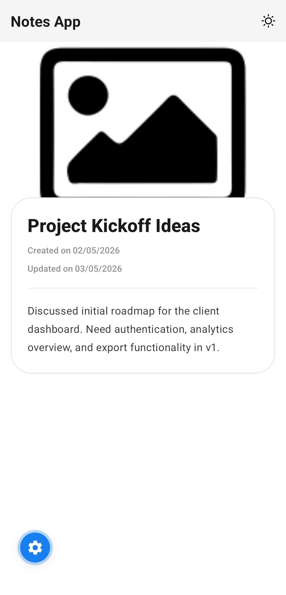
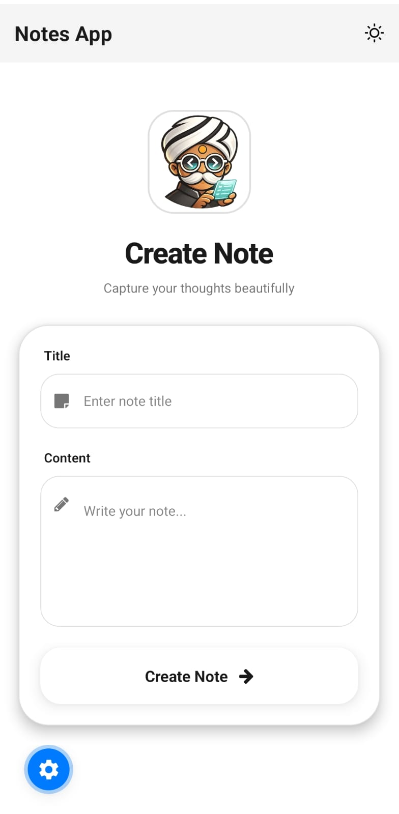
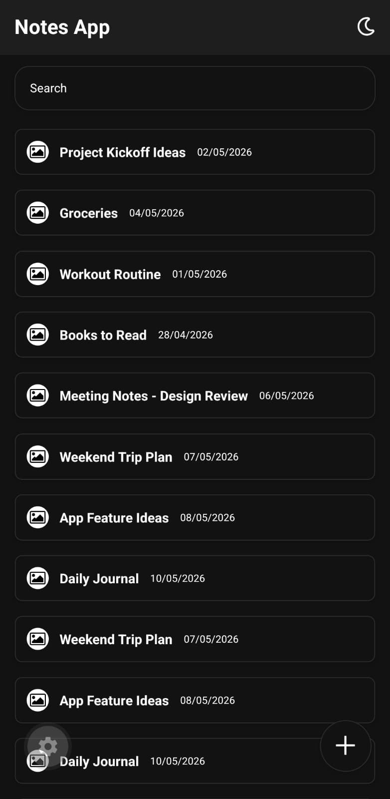
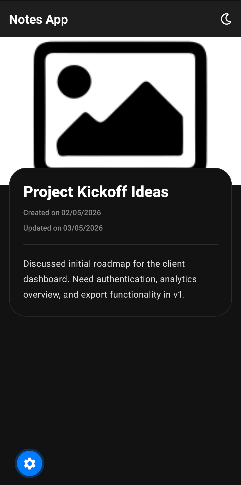
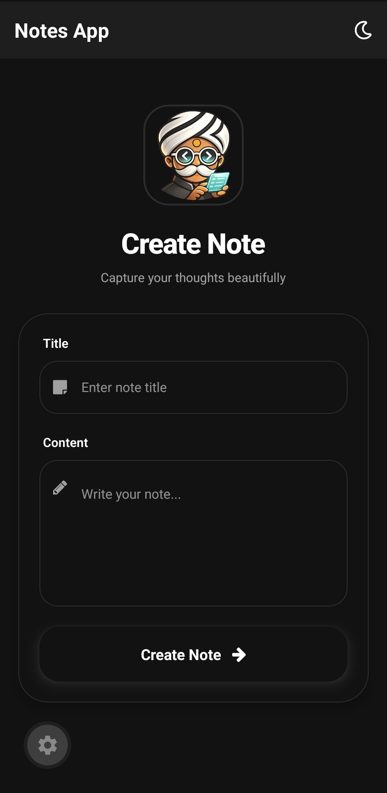

# Notes App 📝

A beautiful, feature-rich notes application built with React Native and Expo Router. This app showcases modern mobile development practices with a stunning UI, smooth animations, and seamless user experience.

---

## ✨ Features

- 📝 **View Notes** - Elegant note display with cover images and formatted content
- ➕ **Create Notes** - Create new notes with title, content, date, and image preview
- 🔍 **Search Notes** - Real-time search functionality
- 🌙 **Dark Mode** - Automatic system theme detection with manual toggle
- 🎨 **Beautiful UI** - Modern design with smooth animations and shadows
- 📱 **Responsive** - Optimized for both iOS and Android
- 🚀 **Type-Safe** - Full TypeScript implementation with Expo Router typed routes

---

## 📸 Screenshots

# ☀️ Light Theme

<table>
  <tr>
    <td align="center">
      <h4>Notes List</h4>
      
    </td>

    <td align="center">
      <h4>Note Detail</h4>
      
    </td>

    <td align="center">
      <h4>Create Note</h4>
      
    </td>
  </tr>
</table>

---

# 🌙 Dark Theme

<table>
  <tr>
    <td align="center">
      <h4>Notes List</h4>
      
    </td>

    <td align="center">
      <h4>Note Detail</h4>
      
    </td>

    <td align="center">
      <h4>Create Note</h4>
      
    </td>
  </tr>
</table>

---

## 🚀 Getting Started

### Prerequisites

- Node.js 18+
- npm or yarn
- Expo Go app (for testing) or iOS/Android emulator

### Installation

1. Clone the repository

```bash
git clone <repository-url>
cd notes-app
```

2. Install dependencies

```bash
npm install
```

3. Start the development server

```bash
npx expo start
```

4. Run the app

- Scan the QR code with Expo Go app
- Press `a` to open on Android emulator
- Press `i` to open on iOS simulator

---

## 🛠 Tech Stack

- **Framework**: React Native with Expo
- **Routing**: Expo Router with typed routes
- **Language**: TypeScript
- **Styling**: React Native StyleSheet
- **Icons**: Expo Vector Icons (FontAwesome, AntDesign)
- **Theme**: Custom theme context with dark/light mode
- **State Management**: React Hooks (useState, useContext)

---

## 📁 Project Structure

```txt
src/
├── app/
│   ├── (main)/
│   │   ├── index.tsx
│   │   ├── notes.tsx
│   │   ├── create.tsx
│   │   ├── note/
│   │   │   └── [id].tsx
│   │   └── _layout.tsx
│   └── _layout.tsx
├── contexts/
│   └── ThemeContext.tsx
├── mock-data/
│   └── notes.ts
└── components/
    └── toggle.tsx
```

---

## 🎨 Theme System

The app features a comprehensive theme system with:

- Automatic system theme detection
- Manual light/dark mode toggle
- Type-safe theme values
- Smooth UI transitions

### Theme Structure

```ts
interface Theme {
  text: string;
  background: string;
  border: string;
  primary: string;
  secondary: string;
}
```

---

## 🔧 Development

### Available Scripts

- `npm start` → Start development server
- `npm run android` → Run on Android
- `npm run ios` → Run on iOS
- `npm run web` → Run on web
- `npm run lint` → Run ESLint

---

## 📱 Navigation

The app uses Expo Router with file-based routing:

- `/` → Home screen
- `/(main)/notes` → Notes list
- `/(main)/create` → Create note screen
- `/(main)/note/[id]` → Note detail page

---

## 🎯 Key Features Explained

### ✨ Create Notes

Users can create new notes with:

- Title
- Content
- Date picker
- Image URL preview

### 🔍 Search Functionality

Real-time filtering of notes by title.

### 🖼 Image Support

Attach note cover images using URLs with instant preview support.

### 🌗 Dynamic Themes

Beautiful light and dark themes with persistent UI consistency.

### 📱 Responsive Design

Optimized layouts for different device sizes and orientations.

### 🔒 Type Safety

Full TypeScript support across routes, themes, and note data.

---

## 🤝 Contributing

1. Fork the repository
2. Create a feature branch
3. Make your changes
4. Test thoroughly
5. Submit a pull request

---

## 📄 License

This project is licensed under the MIT License.

---

## 🙏 Acknowledgments

- Built with Expo
- Icons by Expo Vector Icons
- Routing by Expo Router